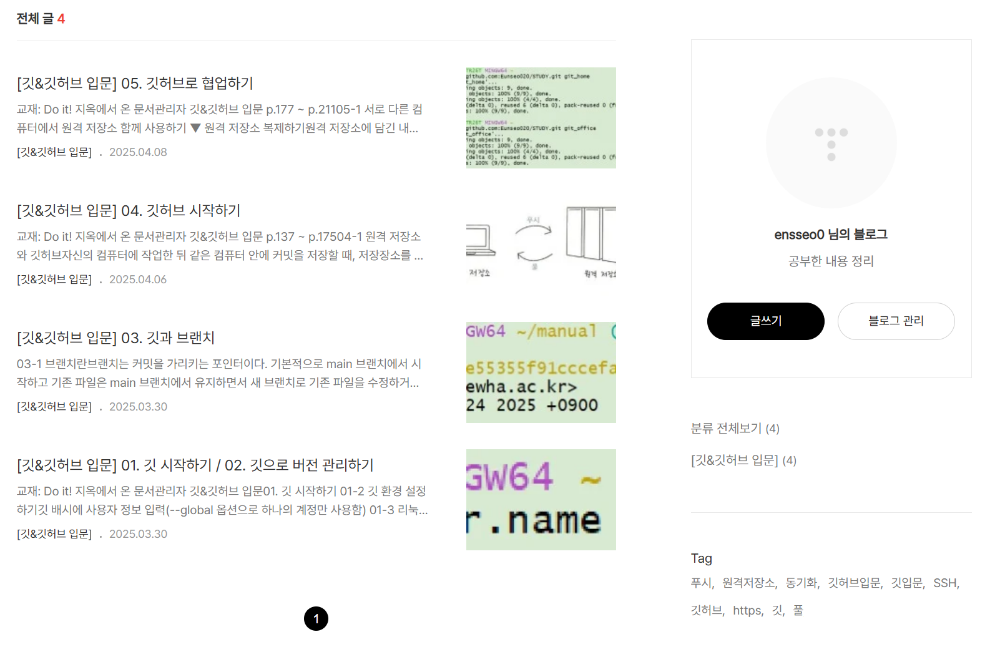

깃허브 사용법 연습

+ 사용교재: Do it! 깃&깃허브

---

티스토리에 공부 내용을 정리하고 있습니다.

<https://ensseo0.tistory.com/>


# 깃허브

1. 원격 저장소 만들기
2. origin 연결하기
3. push
4. fetch와 pull
5. 협업


## 텍스트 꾸미기

**Github**는 *원격저장소*를 제공하는 서비스로 온라인 상에서 Git의 ***버전관리 기능***을 사용할 수 있습니다.

## 소스코드 넣기

`function add(x,y) { return x+y ;}`

```Python
print("Hello new world"")

```
